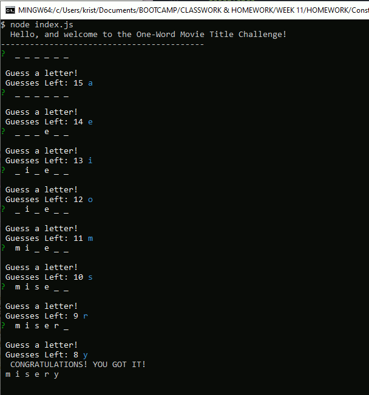

# Week 11 - Advanced Javascript Homework - Constructor Word Guess
_created by Krista Clarke (github - loraxgirl)_ 
**A One-Word Movie Title Challenge!**

## Assignment Details
**UCLA Full-stack Web Development Bootcamp - Week 11 Homework** 
Create a Word Guess command-line game using constructor functions. 

**LIRI will search Spotify for songs, Bands in Town for concerts, and OMDB for movies.**

### Technologies Used
* JavaScript
  * Node.js
    * Inquirer

### Summary
+ Use 3 separate javascript files to parse out the different functions of the CLI.

### Screenshot Of The Game
